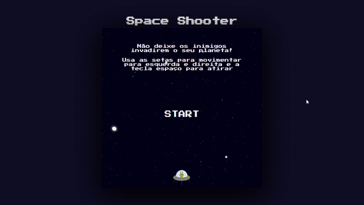

# Space Shooter (projeto DIO)

Projeto desenvolvido durante o Bootcamp JavaScript Game Developer da DIO (Digital Innovation One).

O projeto consiste em um pequeno jogo feito apenas com HTML, CSS e JavaScript. Nele o jogador controla uma nave horizontalmente e pode fazer disparos. O objetivo é destruir as naves inimigas para que elas não passem pelo jogador.


## Demonstração :video_game:

O jogo registra a pontuação do usuário de acordo com os inimigos destruídos e contém um controle de dificuldade progressivo que acelera os inimigos conforme o jogador vai destruindo mais naves. 

Se uma nave inimiga conseguir passar pelo jogador uma janela é exibida com a mensagem de "Game Over", a pontuação e opção de reiniciar o jogo.




## Para executar o projeto :computer:

Basta clonar este repositório 

```
git clone https://github.com/davi-santos5/dio-game-space-shooter.git
```

E executar o arquivo `index.html` no seu navegador de preferência.

Para movimentar utilize as setas para ir para esquerda e direita e a tecla espaço para disparar.
